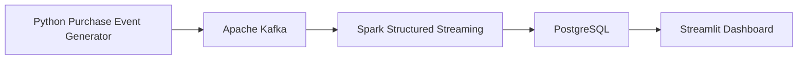

# 🚀 Real-Time Retail Streaming Analytics Platform


---

# 📌 Project Overview

This project demonstrates an **end-to-end real-time retail analytics platform** built using Apache Kafka, Apache Spark Structured Streaming, PostgreSQL, and Streamlit.

Instead of processing historical sales data in batches, this system continuously streams purchase events, processes them in real time, stores them in PostgreSQL, and visualizes live business metrics through an interactive dashboard.

The project simulates a modern event-driven data architecture commonly used in retail and e-commerce systems.

---

# 🎯 Business Problem

Retail businesses require immediate visibility into sales activities to support operational and strategic decision-making.

Traditional batch ETL pipelines cannot provide real-time insights.

This project addresses that challenge by streaming purchase events continuously and enabling live analytics for:

- Sales monitoring
- Revenue tracking
- Customer activity
- Product performance
- Business dashboards

---

# 🏗️ System Architecture



---

# ⚙️ Technology Stack

| Component | Technology |
|------------|------------|
| Programming | Python |
| Streaming Platform | Apache Kafka |
| Stream Processing | Apache Spark Structured Streaming |
| Database | PostgreSQL |
| Containerization | Docker |
| Dashboard | Streamlit |
| Data Serialization | JSON |

---

# 📂 Project Structure

```text
real-time-retail-streaming/

├── consumer/
│   └── spark_streaming.py
│
├── dashboard/
│   └── app.py
│
├── producer/
│   └── producer.py
│
├── docker-compose.yml
│
├── requirements.txt
│
└── README.md
```

---

# 🔄 Streaming Pipeline

The streaming workflow consists of four main stages:

### 1️⃣ Event Producer

Python continuously generates simulated customer purchase events.

Example:

```json
{
  "customer_id":"CUST0008",
  "product_name":"Running Shoes",
  "quantity":2,
  "total_amount":659.80
}
```

---

### 2️⃣ Apache Kafka

Kafka acts as the event broker.

Each purchase event is published to the **`purchases`** topic.

---

### 3️⃣ Spark Structured Streaming

Spark continuously consumes events from Kafka and processes them as micro-batches.

Each processed batch is written into PostgreSQL.

Example output:

```
Batch 1: 1 events written to PostgreSQL.
Batch 2: 2 events written to PostgreSQL.
Batch 3: 1 events written to PostgreSQL.
```

---

### 4️⃣ Live Dashboard

Streamlit queries PostgreSQL to visualize live business metrics.

Displayed KPIs include:

- 💰 Total Revenue
- 📦 Total Orders
- 👥 Total Customers
- 💳 Average Order Value
- 📊 Revenue by Product
- 🥧 Revenue by Category
- 🌍 Revenue by City

---

# 📊 Dashboard Preview

## Live KPI Dashboard


---

## Revenue by Product


---

## Revenue by Category


---

# 🚀 Getting Started

## Clone Repository

```bash
git clone https://github.com/aqilahshi/real-time-retail-streaming.git

cd real-time-retail-streaming
```

---

## Install Dependencies

```bash
pip install -r requirements.txt
```

---

## Start Docker

```bash
docker compose up -d
```

---

## Run Spark Streaming

```bash
python consumer/spark_streaming.py
```

---

## Run Producer

```bash
python producer/producer.py
```

---

## Launch Dashboard

```bash
streamlit run dashboard/app.py
```

---

# 📈 Key Features

✅ Event-driven architecture

✅ Real-time data streaming

✅ Kafka messaging

✅ Spark Structured Streaming

✅ PostgreSQL storage

✅ Interactive Streamlit dashboard

✅ Dockerized infrastructure

---

# 🔮 Future Improvements

Potential enhancements include:

- Real-time customer segmentation
- Fraud detection
- Kafka Connect integration
- Apache Airflow orchestration
- Cloud deployment (AWS / Azure / GCP)
- Kubernetes deployment
- Power BI / Tableau live dashboards

---

# 🔗 Related Projects

This project complements my previous repositories:

### 🛒 Retail Data Engineering Pipeline

Python → PostgreSQL → Spark ETL → Tableau

### 🤖 Retail Customer Intelligence

Feature Engineering → Machine Learning → SHAP → Streamlit

Together, these projects demonstrate an end-to-end modern data engineering and AI workflow from data ingestion to real-time analytics and predictive intelligence.

---

# 👨‍💻 Author

**Aqilah Syahirah**

Master of Science (Computer Science)

Interested in:

- Machine Learning
- Data Engineering
- Explainable AI
- Computer Vision
- Real-Time Analytics
